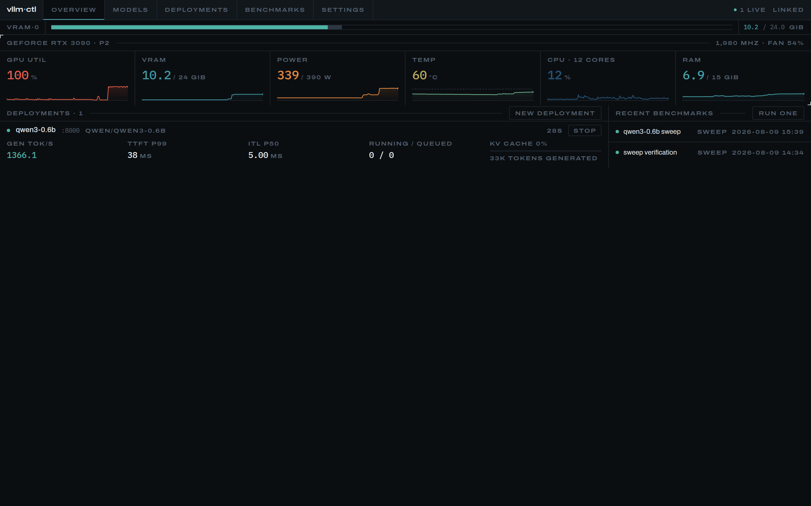

# vLLM Admin UI — Low-Level Design

A local-first control plane for vLLM: manage models, run them with full control
over every engine option, watch the machine in real time, and benchmark what it
can actually serve.

This document explains how it is built and, where a decision was not obvious,
why it was made that way. It is written for someone about to change the code.

---

## 1. Context and constraints

The app targets a single workstation, not a cluster:

| | |
|---|---|
| GPU | 1× RTX 3090, 24 GiB, driver 595.84, CUDA 13.2 |
| Host | 12 cores, 15 GiB RAM |
| vLLM | 0.26.0, in a uv virtualenv (not on `PATH`) |
| GuideLLM | 0.7.3, in an isolated `uv tool` environment |
| Runtime | Node 22, Next.js 16 (App Router), React 19, Tailwind v4 |
| CUDA | toolkit from torch's own wheels (`nvidia/cu13`), pinned to 13.0 to match `torch 2.11.0+cu130` |

Three constraints shape everything below:

1. **24 GiB is a hard wall.** Every decision the user makes — which model, what
   context length, what quantization, what else runs alongside — is really a
   decision about that wall. The UI is built around it.
2. **This is one long-lived Node process.** Supervising child processes and
   streaming telemetry both require state that outlives a request. There are no
   serverless assumptions anywhere in the codebase.
3. **It must feel instant.** A dashboard you distrust is a dashboard you stop
   opening. Section 4 covers how that is achieved concretely.

---

## 2. Architecture

```
Browser ──SSE──▶ /api/stream/*  ──reads──▶ in-memory ring buffers
   │                                              ▲
   └──fetch──▶  /api/*  (mutations)               │ 1 Hz / 2 Hz
                                                  │
              ┌───────────────────────────────────┴─────────────┐
              │  module-scope singletons                          │
              │  sampler · supervisor · metricsPoller             │
              │  · downloads · benchmarks                         │
              └───────────────┬──────────────────────────────────┘
                              │ spawns
                              ├── vllm serve      (one per deployment)
                              ├── hf download     (one per download)
                              ├── guidellm run    (one at a time)
                              └── nvidia-smi      (one per tick)
                              │
                          SQLite (WAL)  ~/.vllm-admin/vllm-admin.db
```

Singletons are stashed on `globalThis` so Next's dev-mode module reloading
cannot produce two samplers or orphan a supervisor's process registry.

`src/instrumentation.ts` runs once per server process before the first request.
It starts the sampler and metrics poller, prunes old telemetry, and reconciles
anything left behind by an unclean shutdown.

---

## 3. Module map

Each module has one job and a narrow interface, so it can be reasoned about and
tested alone.

### Server

| Module | Responsibility |
|---|---|
| `lib/paths.ts` | Every filesystem location, resolved once. All app state lives under `~/.vllm-admin` so the install can be wiped with one `rm -rf`. |
| `lib/settings.ts` | User settings as JSON (repairable by hand when a bad path stops the app booting), plus environment auto-detection. The read cache is keyed on the file's mtime — see §6. |
| `lib/server/db.ts` | `better-sqlite3` handle, WAL mode, forward-only migrations keyed on `user_version`. |
| `lib/server/broadcast.ts` | SSE fan-out hub and the `sseResponse()` helper. |
| `lib/server/ring-buffer.ts` | Fixed-capacity circular buffer. |
| `lib/server/api.ts` | Route-handler helpers; errors come back as `{ error }` written for a human. |
| `lib/telemetry/nvidia.ts` | `nvidia-smi` CSV queries and parsing. |
| `lib/telemetry/host.ts` | CPU/RAM/disk from `/proc` and `statfs`. |
| `lib/telemetry/sampler.ts` | The single 1 Hz loop; ring buffer + batched SQLite writes. |
| `lib/vllm/parse-help.ts` | Parses `vllm serve --help=all` into a typed schema. |
| `lib/vllm/flag-schema.ts` | Runs vLLM to get that help text; caches per version. |
| `lib/vllm/argv.ts` | Builds and parses `vllm serve` command lines. |
| `lib/vllm/host.ts` | Bind host vs. connect host; the one place a wildcard becomes a dialable address. |
| `lib/vllm/supervisor.ts` | Process registry and lifecycle FSM. |
| `lib/vllm/log-ring.ts` | Bounded per-process log storage and line splitting. |
| `lib/vllm/phase.ts` | Turns vLLM log lines into phase labels and fatal-error messages. |
| `lib/vllm/prometheus.ts` | Prometheus text parsing, histogram quantiles, counter rates. |
| `lib/vllm/metrics.ts` | 2 Hz scraper that turns those into displayable metrics. |
| `lib/hf/cache.ts` | Native scan/delete of the Hugging Face cache; `config.json` parsing. |
| `lib/hf/search.ts` | Hub API search and metadata. |
| `lib/hf/download.ts` | Wraps the `hf` CLI, parsing tqdm output into progress. |
| `lib/vram/estimate.ts` | The VRAM model behind the fit badge and the guard rail. |
| `lib/guidellm/argv.ts` | Builds the `guidellm run` command line. |
| `lib/guidellm/runner.ts` | Runs benchmarks, ingests results, serves history. |
| `lib/guidellm/ingest.ts` | Parses GuideLLM's report JSON; finds the saturation point. |

### Client

| Module | Responsibility |
|---|---|
| `lib/client/use-sse.ts` | One EventSource per URL, handlers read through a ref. |
| `lib/client/telemetry-store.tsx` | Shared telemetry window for the whole page. |
| `lib/client/deployments-store.tsx` | Live deployments, plus the *projection* used by the headroom rail. |
| `lib/client/use-now.ts` | A clock in state, so elapsed times don't make render impure. |
| `lib/client/api.ts` | fetch wrapper that unwraps `{ error }`. |
| `components/charts/Sparkline.tsx` | Canvas time-series for live data. |
| `components/charts/XYChart.tsx` | SVG chart for static benchmark results. |

---

## 4. How "fast" is achieved

Not aspiration — these are the specific mechanisms.

**One sampler, many viewers.** A single 1 Hz `nvidia-smi` loop and one `/metrics`
scrape per deployment, fanned out over SSE. An extra browser tab costs one more
`enqueue()` call, not another subprocess. Verified with `pgrep -fc nvidia-smi`
while three tabs are open: still one.

**One-shot `nvidia-smi`, not `-l 1`.** Loop mode looks cheaper but block-buffers
its stdout when not attached to a tty, and ignores `stdbuf`; a piped `-l 1`
emits nothing for seconds at a time. A one-shot query measures **24 ms** here,
which is a rounding error at 1 Hz.

**Ring buffers in front of SQLite.** The last ~15 minutes of telemetry lives in
memory, so a chart hydrates from one request with zero DB reads. SQLite is
written in batches of 15 samples and only read for history and benchmark
overlays.

**Canvas for live traces, SVG for static ones.** A DOM-based chart library
re-reconciles hundreds of nodes per tick; with a dozen live traces at 1 Hz that
janks. Live traces render to `<canvas>`. Benchmark results never change once a
run finishes, so they use SVG and get crisp text, hover targets and accessible
markup for free. No charting dependency is installed.

**The 274-option schema is computed once.** `vllm serve --help=all` imports
torch and takes seconds, so it is parsed once, cached on disk keyed by vLLM
version, and memoised in the process. The settings form is then a static
payload.

**Backpressure-aware log streaming.** vLLM emits hundreds of lines in bursts.
Lines are appended to a bounded 5,000-line ring and SSE frames are coalesced on
a 100 ms timer, so a CUDA-graph capture produces a handful of frames rather than
hundreds.

---

## 5. The vLLM option schema

The centrepiece of "exhaustively specify all deployment settings".

Hand-maintaining a list of vLLM's options would be wrong the day vLLM is
upgraded. Instead the app runs `vllm serve --help=all` against the *installed*
engine and parses argparse's own output. On vLLM 0.26.0 that yields **274
options across 17 config groups** (`Frontend`, `ModelConfig`, `CacheConfig`,
`ParallelConfig`, `CompilationConfig`, …).

### Output shapes handled

```
--headless                                   boolean, no negative form
--allow-credentials, --no-allow-credentials  negatable boolean pair
--gdn-prefill-backend {flashinfer,triton}    enum
--api-key API_KEY [API_KEY ...]              variadic value
--data-parallel-address ADDR, -dpa ADDR      long form plus short alias
--data-parallel-external-lb, --no-…, -dpe    negatable boolean with alias
```

### Edge cases that a naive parser gets wrong

- **Commas inside choice lists.** `--fmt {auto,openai,string}` must not be split
  on its inner commas. `splitTopLevel()` tracks `{}`/`[]` depth. This was caught
  by a test before it shipped: without it, one flag parsed as three and lost its
  enum entirely.
- **Wrapped help text.** argparse wraps at column 72 and `(default: X)` can be
  split across those lines, so help is joined before the default is extracted.
- **Negative forms.** `--no-x` is never emitted as its own option; it sets
  `negatable` on `x`.
- **Type inference.** Choices → `enum`; no value → `boolean`; `[X ...]` →
  `list`; JSON-ish help or default → `json`; otherwise the default's shape
  (integer / float / `True`/`False`), falling back to name heuristics
  (`*-size`, `*-len` → int; `*utilization*`, `*fraction*` → float).

### Tri-state values

A flag with no value set is **not passed at all**, so vLLM's own default
applies. Booleans therefore have three UI states — unset / enabled / disabled —
because "unset" and "false" mean different things and pinning a default that
changes between vLLM versions is a real hazard.

### One builder, one command

`buildServeArgv()` produces both the preview shown in the UI and the argv the
supervisor spawns. There is no second code path, so the preview cannot lie.
`parseServeCommand()` is its inverse, letting an existing shell command be
imported into the form.

The invariant is only as good as its inputs: the preview once hardcoded
`--host 127.0.0.1` while the supervisor passed the configured `serveHost`, so
the two disagreed for anyone who changed the bind address. The form now reads
that setting like the supervisor does.

**Essentials tier.** A curated list is lifted above the groups and sorted in
reach-for order, not alphabetically. Names a given vLLM build lacks are simply
not marked, so the tier degrades on upgrade rather than breaking. (0.26 dropped
`--swap-space` with the V0 engine, for instance.)

---

## 6. Deployment lifecycle

```
          spawn
            │
        ┌───▼────┐  log line implies work    ┌─────────┐
        │starting├──────────────────────────▶│ loading │
        └───┬────┘                           └────┬────┘
            │                    /health responds │
            │                        ┌────────────▼──┐
            │                        │    healthy    │
            │                        └───┬───────┬───┘
            │           user stops       │       │  process exits
            │                    ┌───────▼──┐  ┌─▼───────┐
            └───────────────────▶│ stopping │  │ crashed │
              fatal log / timeout└────┬─────┘  └─────────┘
                    │                 │
              ┌─────▼──┐        ┌─────▼───┐
              │ failed │        │ stopped │
              └────────┘        └─────────┘
```

**Why `starting` and `loading` are separate.** Weight loading, `torch.compile`
and CUDA graph capture can take minutes, during which `/health` refuses
connections. Without the distinction the UI would show an unchanging "starting"
and look hung. `lib/vllm/phase.ts` matches vLLM's own log lines to produce
labels like "loading weights", "compiling graphs", "capturing cuda graphs", so
a long start reads as progress.

**Only `/health` grants `healthy`.** A log line may promote `starting` →
`loading`, but never claims readiness; only a real HTTP 200 does.

**Bind host and connect host are different things.** `serveHost` is what
`vllm serve --host` receives; it is recorded per run on the supervised record
(not read from settings on demand, so a setting changed mid-flight cannot
rewrite the history of a process already listening elsewhere) and surfaced on
`LiveDeployment.host`, which is what the endpoint readout displays. Everything
that *dials* the engine — the health probe, the metrics scrape, the benchmark
target — goes through `connectHost()` in `lib/vllm/host.ts`, because a wildcard
bind is not a destination: `http://0.0.0.0:8000` never connects, so it collapses
to loopback. Probing loopback unconditionally, as an earlier version did, worked
by luck for `0.0.0.0` and failed outright for a specific LAN address — the
engine served fine while the app declared it dead at the ready timeout.
`isPortBusy()` listens on the bind host for the same reason: a port free on
loopback can still be taken on the interface vLLM is about to claim.

**A saved setting has to reach the process that acts on it.** `getSettings()`
caches the parsed file in a module-level variable, and `saveSettings()` used to
keep it coherent by calling `invalidateSettings()` from the settings route. That
is not enough: Next's production build instantiates `lib/settings.ts` more than
once — route handlers land in separate server bundles — so each copy holds its
own cache and the invalidation only ever clears the one in the settings route.
A bind address changed in the UI was therefore visible to `GET /api/settings`
while the deployment route kept launching on whatever host it happened to read
first, which is exactly how a server ends up on `127.0.0.1` after the setting
says `0.0.0.0`. The cache is now keyed on the settings file's mtime and size, so
a write by any instance is picked up by all of them — and by a hand edit to the
file, which the design invites. Verified with a specific LAN address, the case
that fails loudest.

**Fatal-error translation.** Known failure signatures are turned into an
actionable sentence rather than a Python traceback — CUDA OOM becomes "Out of
GPU memory. Lower `--gpu-memory-utilization` or `--max-model-len`, or stop
another deployment."

**Process groups.** Children are spawned `detached: true` and signalled with
`process.kill(-pid, …)`. vLLM forks engine-core workers; signalling only the
parent leaves them alive and holding VRAM. Shutdown is SIGINT (which vLLM
handles cleanly, releasing VRAM) escalating to SIGKILL after 20 s.

**Carriage returns.** Progress bars are redrawn with `\r` and carry no newline
until they finish, so the splitter normalises `\r` → `\n`. Without this the log
sits silent for the entire weight download — exactly the phase a user wants to
watch. (Found during end-to-end testing on a 13 GB download.)

**The child's environment is not this process's environment.** Two things must
be set up or the engine dies during initialisation, and both were found by
running a real model rather than by reading code:

- `PATH` gets the virtualenv's own `bin` prepended, exactly as `activate` would.
  Spawning `vllm` by absolute path is not enough: it shells out to build tools
  that live beside it — `ninja`, for torch's C++ extensions — and without this
  they are invisible.
- `CUDA_HOME` is set to a detected toolkit root. vLLM JIT-compiles kernels and
  resolves `nvcc` through `CUDA_HOME`, falling back to `/usr/local/cuda`. A
  machine with only the NVIDIA *driver* therefore fails every launch even though
  torch's own wheels ship a complete toolkit in `site-packages/nvidia/cu13/`,
  which vLLM never looks at. `detectCudaHome()` searches `$CUDA_HOME`, then the
  vLLM environment's site-packages, then the usual system paths.

**Orphan reconciliation.** A PID file records live children. On boot, any that
survived an unclean shutdown are signalled and their DB rows marked `crashed`.
Re-adopting them is not possible — their stdout is gone — so killing them is the
honest outcome; it keeps the headroom rail truthful.

---

## 7. VRAM estimation and the guard rail

```
weights  = params × bytes-per-weight(dtype or quantization) / tensor-parallel
kv/token = 2 × layers × kv_heads × head_dim × bytes(kv_dtype) / tensor-parallel
total    = weights + kv/token × max_model_len + activation overhead (~1.2 GiB)

budget    = total_vram × gpu_memory_utilization
available = budget − currently_used − safety_margin
```

Validated against ground truth for `granite-4.1-8b`, whose real figures were
documented in the machine's existing `serve.py`: 40 layers, GQA 32/8,
`head_dim` 128 → **160 KiB/token** and **~15.6 GiB** of bf16 weights. Both are
asserted in `src/lib/vram/estimate.test.ts`.

**Weight size is measured, not derived.** `model.safetensors.index.json` states
`total_size`, and failing that the weight files are stat-ed. Deriving weight
size from a parameter count instead means guessing the effective bytes-per-weight
of whatever quantization the checkpoint uses — precisely what breaks on a format
the app has not seen. `gpt-oss-20b` (MXFP4 MoE) is the case that exposed this:
an unknown format fell back to 2 bytes/param, and the parameter count was itself
derived by dividing by that same wrong figure, so two errors cancelled into a
right-looking answer for the wrong reason.

Parameter count is now a *display-only* figure, derived from measured bytes
divided by the format's effective width. It stays approximate for checkpoints
that mix precisions — `gpt-oss-20b` reads as ~26B against a real 20.9B, because
its MoE weights are MXFP4 while attention stays bf16 — but nothing depends on
it. The VRAM estimate uses the measured bytes directly.

**It fails closed.** If `config.json` doesn't give enough shape to size the
model, the estimate is marked `known: false` and **never** reports `fits: true`.
An early version returned "fits" for an unknown model because weights and KV
both computed as zero — precisely the launch the guard rail exists to catch. The
API returns HTTP 409 with `overridable: true`, and the UI offers "start anyway"
rather than blocking outright.

---

## 8. Engine metrics

vLLM exposes Prometheus text at `/metrics`. Neither shape is directly
displayable:

- **Counters** (`vllm:generation_tokens_total`) are differenced against the
  previous scrape to become rates. A negative delta means the server restarted,
  and yields 0 rather than a nonsense rate.
- **Histograms** (`vllm:time_to_first_token_seconds`) are interpolated the way
  Prometheus' own `histogram_quantile` does, and **differenced between scrapes
  first** — an all-time p99 would be pinned forever by the first cold request.
  When a quantile lands in the `+Inf` bucket the last finite bound is returned
  rather than a fabricated larger number.

These are estimates limited by bucket granularity, and the UI says so; a
benchmark measures latency directly.

**VRAM attribution walks process ancestry.** vLLM's API server does not touch
the GPU itself — it forks a `VLLM::EngineCore` worker that owns the entire
allocation. Matching `nvidia-smi --query-compute-apps` against only the pid we
spawned reported *null* for a deployment plainly holding 10 GiB, so the sampler
walks each compute process's parent chain via `/proc/<pid>/stat` and sums
everything descended from the supervised pid. This is what makes the headroom
rail's per-deployment segments real rather than a single undifferentiated block.

Metrics are read into `supervisor.list()` through `globalThis.__vllmAdminMetrics`
rather than a direct import, because the poller imports the supervisor and a
static cycle would leave one singleton undefined at module-eval time.

---

## 9. Hugging Face integration

The cache layout is stable and documented:

```
<cache>/models--org--name/
  blobs/<sha>          actual content, deduplicated
  snapshots/<rev>/...  symlinks into blobs
  refs/<ref>           file containing a revision hash
```

Read in TypeScript rather than via Python: the models page becomes a filesystem
walk instead of a 1–2 second interpreter start.

**The subtlety.** Revisions share blobs, so summing per-revision sizes
double-counts. True on-disk size comes from walking `blobs/` once; per-revision
size resolves symlinks through a shared `seen` set. Deleting a single revision
then garbage-collects unreferenced blobs — otherwise "delete" would free no disk
at all, the outcome a user would least expect. Deletion paths are checked to
resolve inside the configured cache root.

**Downloads** shell out to `hf download` rather than reimplementing resumption,
xet chunk dedup and multi-worker fetching. Its tqdm output (`\r`-redrawn) is
parsed into structured percentages and byte counts.

---

## 10. GuideLLM integration

GuideLLM is the vLLM project's own load-testing tool, so it stays in lockstep
with the server.

### Command

```
guidellm run
  --backend    kind=openai_http,target=http://127.0.0.1:8000,model=<served-name>
  --profile    kind=sweep,sweep_size=10        # or synchronous | concurrent,streams=N
                                               # | throughput | constant,rate=N | poisson,rate=N
  --data       kind=synthetic_text,prompt_tokens=256,output_tokens=128
  --constraint kind=max_duration,seconds=30    # repeatable
  --output     kind=json,path=<run-dir>/benchmark.json
  --disable-console-interactive
```

Version-pinned to **0.7.3**. Releases before this used
`guidellm benchmark --rate-type`; the app asserts the installed version and
surfaces a mismatch as a settings banner rather than a broken run. As with
vLLM, one builder produces both the preview and the spawned argv.

### Two traps, both handled

1. **An unconstrained sweep never terminates.** If no constraint is configured,
   a 60-second duration limit is added rather than letting a run hang forever.
2. **Synthetic prompts need a tokenizer**, and GuideLLM resolves it from the
   *model name* — which here is a served alias like `granite-4.1-8b`, not a
   Hugging Face repo. Left alone the run dies seconds in with an opaque
   `OSError`. The API fills the tokenizer in from the real model id, and the
   form warns when it cannot. (Found by running a real benchmark against
   `guidellm mock-server`.)

### Result schema

Parsed against a real captured report, not the docs. Per benchmark:
`config.strategy.{type_,streams,rate,max_concurrency}`,
`metrics.<name>.successful.{mean,percentiles.{p50,p95,p99}}`, and
`start_time`/`end_time` as float epoch **seconds**.

**Units are mixed and the field names say which.** `*_ms` metrics are already
milliseconds; `request_latency` is in **seconds**. Getting that wrong would
misreport end-to-end latency by 1000×, so the conversion is explicit and
directly asserted in tests.

### Saturation point

The knee is the lowest load level already within 5% of peak output throughput —
past it you are buying queueing delay rather than tokens. It is the single
number most people run a sweep to find, so it gets its own panel and is marked
on both charts and in the results table.

### Telemetry overlay

Because the app samples the GPU at 1 Hz regardless, a finished run can be
replayed against `telemetry_samples` over its own window. This is the thing
GuideLLM alone cannot show: whether the later load levels were measured on a
thermally throttled card, which would invalidate the comparison.

Only one benchmark runs at a time — two load generators on one GPU would make
both results meaningless.

---

## 11. Data model

SQLite, WAL, `synchronous = NORMAL` (durable enough for telemetry, much faster).

| Table | Contents |
|---|---|
| `deployments` | Saved launch profiles; `flags` is JSON of non-default options only. |
| `deployment_runs` | One row per launch: resolved argv, pid, status, timings, exit code, log path. |
| `telemetry_samples` | `(ts, gpu_index)` primary key, `WITHOUT ROWID`. Pruned on boot past the retention window. |
| `deployment_metrics` | `(ts, run_id)`, `WITHOUT ROWID`. Derived engine metrics. |
| `benchmark_runs` | Config, argv, status, progress, timings, result path. |
| `benchmark_results` | One row per strategy within a run — the flattened chart source. |
| `downloads` | Repo, revision, status, bytes, message. |

`WITHOUT ROWID` on the two time-series tables stores rows in primary-key order,
which is exactly the order every range query reads them in.

---

## 12. HTTP surface

### Streams (SSE)

| Route | Events |
|---|---|
| `/api/stream/telemetry` | `history` once on connect (the whole in-memory window, so charts paint fully drawn), then `sample` per tick |
| `/api/stream/deployments` | `state` on every lifecycle or metric change; `exited` on process exit |
| `/api/stream/deployments/[runId]/logs` | `lines` — batched, not per line |
| `/api/stream/downloads` | `state` |
| `/api/stream/benchmarks` | `state` |
| `/api/stream/benchmarks/[id]/logs` | `lines`; a finished run's tail is read back from disk |

### Mutations

`/api/deployments` (CRUD) · `/api/deployments/{start,stop,restart,history}` ·
`/api/models/{cache,search,detail,download}` · `/api/vram` · `/api/flags` ·
`/api/benchmarks` + `/api/benchmarks/[id]{,/cancel}` · `/api/settings`

Model repo ids contain slashes, so `/api/models/detail` takes `?repo=` rather
than a path segment.

---

## 13. Design language — "Rack Instrument"

**Palette.** A cold graphite canvas (`#0b0e11`), never pure black. The chrome
accent is a deliberately desaturated arctic cyan (`#5ec8d8`) used *only* for
focus, active nav and primary actions. All other colour is a **thermal ramp**
with physical meaning — `#1f3a5f` idle → `#2e7ba6` → `#4fb3a5` nominal →
`#e8a33d` loaded → `#e05b49` saturated — used exclusively inside data marks.

Status colours are *points on that same ramp*: healthy is the same teal as a
mid-load chart series, failed the same vermilion as saturation. One vocabulary,
learned once, rather than two palettes that happen to coexist.

**Type.** Archivo for the interface and, at its wide optical width, for engraved
rack nameplates (`.plate`: 10 px, uppercase, +0.14 em tracking). IBM Plex Mono
for every number, with tabular figures so digits never shift width at 1 Hz.

**Structure.** Panels are regions delimited by hairlines, not cards with radius
and shadow. Emphasis comes from **corner registration ticks** — the marks on an
engineering drawing — reserved for live panels.

**Signature: the headroom rail.** A 24 GiB wall governs every decision in this
app, so the allocation of that wall is pinned under the nav on every screen,
segmented by which process owns which slice. When you configure a deployment its
projected footprint appears as a hatched ghost segment on that same rail, going
red when it would overcommit. The guard rail is not a separate widget; it is the
instrument you have been reading all along. This is what
`DeploymentsProvider.projection` exists for.

**Motion rule.** Movement is reserved for transitional state. A healthy, steady
system is completely still; anything that breathes or pulses is asking for
attention. `prefers-reduced-motion` disables it all.


Under load the ramp does its work without a legend: GPU utilisation goes red at
100%, power amber against its cap, temperature still teal at 56 °C — three
different quantities, one scale, read at a glance.



One rule the ramp taught us during testing: colour-by-magnitude is only
meaningful against a *known* ceiling. An autoscaled series has its newest value
near the top of its own window by construction, so ramping it painted an idle
throughput trace saturation-red and said nothing. Autoscaled traces are now a
flat categorical teal, and the ramp is reserved for series with a real maximum
(percentages, power against cap).

---

## 14. Testing

104 tests over the logic that carries real risk of being subtly wrong, all
against captured real-world fixtures rather than invented ones.

| Suite | Fixture | Covers |
|---|---|---|
| `vllm/parse-help.test.ts` | verbatim 1,818-line `--help=all` from vLLM 0.26.0 | all six signature shapes, wrapped defaults, type inference, group recovery, the comma-in-choices bug, value coercion |
| `vllm/prometheus.test.ts` | vLLM-shaped exposition text | label parsing with embedded commas, histogram quantile interpolation and monotonicity, `+Inf` handling, counter-reset behaviour, windowed deltas |
| `vram/estimate.test.ts` | granite-4.1-8b ground truth | 160 KiB/token, 15.6 GiB weights, fp8 KV doubling context, quantization savings, tensor-parallel division, fail-closed on unknown models |
| `guidellm/guidellm.test.ts` | a real 0.7.3 report from `guidellm mock-server` | argv for every profile/data/constraint, seconds→ms conversion, saturation-point detection, malformed-report tolerance |
| `vllm/host.test.ts` | bind addresses | wildcard → loopback for v4 and v6, bare IPv6 bracketing, every spelling of loopback for the exposure warning |
| `settings.test.ts` | a temporary data dir | defaults written on first run, and a write by one module instance being seen by another — the staleness that let a changed bind address go unused |

The supervisor is not unit-tested against a real 16 GiB model load; it was
verified end-to-end instead (section 15).

Run: `npm test` · `npm run typecheck` · `npm run lint`.

---

## 15. Verification performed

Static checks: clean production build (30 routes), 118 passing tests, clean
`tsc --noEmit` and `eslint`.

### End-to-end, against a real served model

`tools/e2e.mjs` drives the actual UI with Playwright: it fills the deployment
form, starts the engine, waits for `healthy`, drives real inference, runs a
GuideLLM benchmark and screenshots every step. Every image in these docs comes
from that run, so they cannot drift from the product.

A complete pass on this machine (`Qwen/Qwen3-0.6B`, `max-model-len=4096`,
`gpu-memory-utilization=0.35`):

| | |
|---|---|
| Time to `healthy` | 30 s (warm JIT cache) |
| Inference driven | **536 completions, 0 failures** at concurrency 4 |
| Peak observed | 1,372 generated tok/s, TTFT p50 15 ms, ITL p50 5 ms |
| VRAM attributed | 9.73 GiB, matching `nvidia-smi` |
| Benchmark | 4 sweep levels, saturation at 368 concurrent / 5,440 tok/s |
| Telemetry captured | 90 samples across the run window for the overlay |
| Console errors | none |

The sweep is a clean illustration of the trade-off the tool exists to expose:

| Strategy | Concurrency | Output tok/s | TTFT p50 |
|---|---|---|---|
| synchronous | 1.0 | 364 | 15 ms |
| constant | 12.8 | 2,795 | 22 ms |
| constant | 77.2 | 4,148 | 50 ms |
| throughput | 368.1 | 5,440 | 5,297 ms |

15× the throughput for 350× the time-to-first-token.

### Findings from that run

Things only a real launch surfaced, all fixed:

- **`PATH` and `CUDA_HOME` for the child** (section 6). Three consecutive
  launch failures — missing `nvcc`, then missing `ninja`, then a `-lcudart`
  link error — each of which the app now names in plain language rather than
  reporting "exited with code 1".
- **VRAM attribution across process ancestry** (section 8): the headroom rail
  showed nothing for a deployment holding 10 GiB.
- **Carriage-return progress bars** buffered a 13 GB download into silence, so
  the splitter now normalises `\r` → `\n`.
- **Colour-by-magnitude on autoscaled traces** was meaningless (section 13).

### Bind address, verified on both wildcard and LAN address

The bind-address work (§6) was verified the same way, driving the real UI:

| Bind address | Preview | Socket (`ss -tlnp`) | Endpoint readout | Reached `healthy` | Metrics |
|---|---|---|---|---|---|
| `0.0.0.0` | `--host 0.0.0.0` | `0.0.0.0:8000` | `0.0.0.0:8000` | yes | yes |
| `192.168.0.70` | `--host 192.168.0.70` | `192.168.0.70:8000` | `192.168.0.70:8000` | yes | yes |

The LAN-address row is the one that matters: `curl http://127.0.0.1:8000/health`
gets nothing (the engine is not on loopback) while `http://192.168.0.70:8000`
answers 200 and the app tracks it correctly. Before the fix the deployment sat
in `loading` until the ready timeout killed a perfectly healthy engine. With
`0.0.0.0`, a benchmark started against the run recorded its target as
`http://127.0.0.1:8000` rather than the unusable `http://0.0.0.0:8000`.

Both runs also confirmed the settings-cache fix: the launch used the address
saved moments earlier, from a route other than the one that saved it.

### Earlier partial verification

Before the CUDA toolchain was aligned, a `granite-4.1-8b` launch confirmed the
supervisor independently of whether the engine could start: vLLM's own
`non-default args` echo matched the previewed command exactly, the lifecycle
reported `loading` with phase labels, 13 GB of weights downloaded, 17.5 GiB of
VRAM was allocated, and on failure the process group was reaped with no orphans
and VRAM returned to baseline.

---

## 16. Known limitations

- **No authentication.** The app itself binds to loopback and assumes a single
  trusted user. It must not be exposed to a network. Deployments bind to
  `serveHost`, which can be widened to `0.0.0.0` or a specific interface —
  Settings warns whenever that is not a loopback address, because the vLLM
  endpoints it starts are unauthenticated unless `--api-key` is set.
- **Latency percentiles from `/metrics` are approximations** bounded by vLLM's
  histogram buckets. Benchmarks measure directly.
- **VRAM estimates are estimates.** vLLM's allocator also holds CUDA graphs,
  activation buffers and fragmentation that no static formula predicts exactly.
- **A restart cannot re-adopt orphans.** Their stdout is unrecoverable, so they
  are stopped instead.
- **Single GPU in the UI.** Telemetry and the VRAM guard are written per-device,
  but the headroom rail and estimator currently read GPU 0.
- **GGUF models cannot be sized.** They carry no `config.json`, so the estimator
  reports "cannot verify" rather than guessing.
- **The CUDA toolchain must be internally consistent.** vLLM JIT-compiles
  kernels, and the pip toolkit is split across `nvidia-cuda-nvcc`,
  `nvidia-cuda-crt`, `nvidia-nvvm` and `nvidia-cuda-runtime`, which can drift to
  different versions and fail in four distinct ways. The app detects and reports
  the toolkit root but deliberately does not repair the environment; the README
  troubleshooting table maps each error to its fix.
- **`vllm serve --help=all` costs a few seconds** on first load per vLLM
  version, because it imports torch. Thereafter it is cached on disk.
