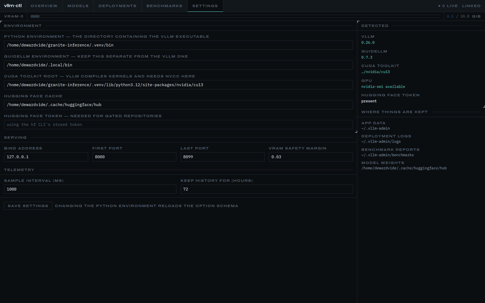
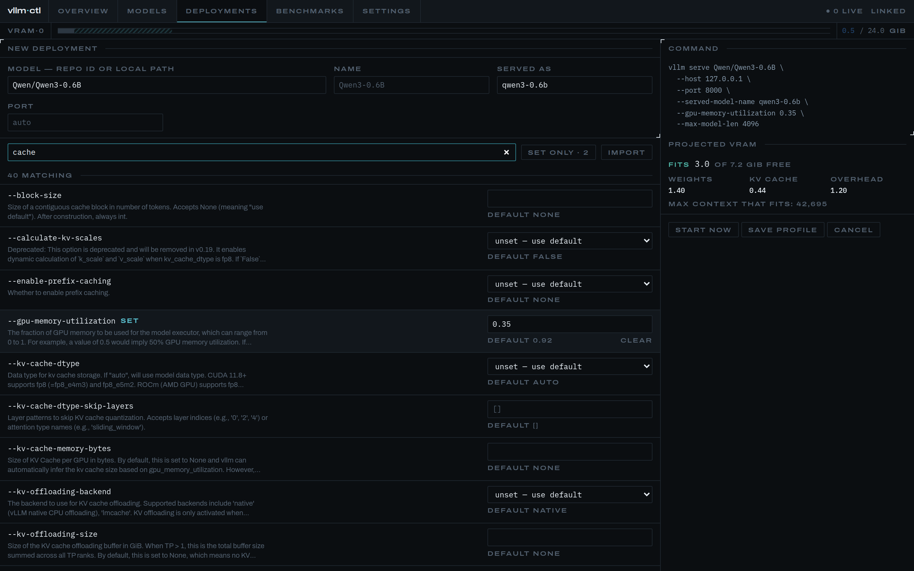

# vllm·ctl

A local control plane for [vLLM](https://github.com/vllm-project/vllm) on a
single workstation. Manage models, run them with full control over every engine
option, watch the machine in real time, and measure what your GPU can actually
serve.

Four things it does:

1. **Models** — search Hugging Face, download with live progress, see what's on
   disk, delete what isn't earning its space, and check whether a model will
   fit in your VRAM *before* you try to run it.
2. **Deployments** — start and stop vLLM servers with every one of its options
   exposed (274 on vLLM 0.26), a live command preview, and a guard rail that
   stops you launching something that won't fit.
3. **Telemetry** — GPU utilisation, VRAM, power, temperature and clocks at 1 Hz,
   alongside per-deployment engine metrics: tokens/sec, TTFT, inter-token
   latency, queue depth, KV cache pressure.
4. **Benchmarks** — [GuideLLM](https://github.com/vllm-project/guidellm) runs
   driven from the UI, with results parsed into charts and the GPU's own
   telemetry overlaid on the run timeline.


> **This app has no authentication.** It starts processes and deletes files on
> your machine. It binds to `127.0.0.1` and is meant for one trusted user on one
> workstation. Do not expose it to a network.

---

## Requirements

| | |
|---|---|
| Node | 22 or newer |
| Python | a virtualenv with **vLLM 0.9+** installed (0.26 is what this was built against) |
| GPU | an NVIDIA card with `nvidia-smi` on `PATH` |
| CUDA | a **CUDA toolkit** (`nvcc`), not just the driver. Usually already inside your torch install — see Troubleshooting |
| Optional | `guidellm` for benchmarks, `hf` for downloads (ships with `huggingface_hub`) |

## Install

```bash
npm install
npm run build
npm start          # http://localhost:3000
```

For development: `npm run dev`.

### First run

The app auto-detects its environment on first launch and writes
`~/.vllm-admin/settings.json`. It looks for a `vllm` executable in any
`~/*/.venv/bin`, then `~/.local/bin`, then `PATH` — so a `uv` project
environment is usually found without configuration.

Open **Settings** to confirm. It shows the detected vLLM version, the GuideLLM
version, the CUDA toolkit root, whether `nvidia-smi` works, and whether a
Hugging Face token is available. Anything missing is called out with what to do
about it.



To enable benchmarks, install GuideLLM in its **own** environment so it cannot
disturb your vLLM one:

```bash
uv tool install 'guidellm[recommended]'
```

For gated models, either run `hf auth login` or paste a token into Settings.

---

## Using it

### Models

The left side is your Hugging Face cache: every repo, its true on-disk size
(counting shared blobs once), revisions, and a delete button that actually
reclaims disk. The right side searches the Hub.

Click any model to open its detail panel. This is the one that matters on a
24 GB card:

- **Will it fit** — pick a context length from the stops and the panel tells
  you, splitting the answer into weights, KV cache and overhead. Switch the KV
  cache to `fp8_e4m3` and watch the usable context roughly double.
- **Longest context that fits** — computed for your current free VRAM.
- **Deploy this** — carries the model and your chosen context into the
  deployment form.

If a model can't be sized (GGUF builds carry no `config.json`), it says
"cannot verify" rather than guessing.


### Deployments

**Essentials** are at the top in the order you actually reach for them —
`--max-model-len`, `--gpu-memory-utilization`, `--dtype`, `--quantization`,
`--kv-cache-dtype`, and so on. Below that, every remaining option grouped
exactly as vLLM groups them (`ModelConfig`, `CacheConfig`, `ParallelConfig`,
`CompilationConfig`, …). Search covers names, aliases and help text.



Three things worth knowing:

- **Unset means unset.** An option you don't touch is not passed at all, so
  vLLM's own default applies. Booleans have three states — unset, enabled,
  disabled — because "unset" and "disabled" are different instructions.
- **The command preview is the command.** It's generated by the same code that
  spawns the process, so it cannot drift from what runs.
- **Import** pastes an existing `vllm serve …` command into the form.


Press **start now** to launch, or **save profile** to keep the configuration for
later. While a server loads you'll see its real phase — "loading weights",
"compiling graphs", "capturing cuda graphs" — because a two-minute start should
look like progress, not a hang.


If the projected VRAM doesn't fit, the start is refused with a specific reason
and, where possible, the context length that *would* fit. You can override it.

Open a running deployment for live logs, engine metrics and a config summary.


### Benchmarks

Pick a live deployment and a load profile. The profiles are described by the
question they answer:

| Profile | Answers |
|---|---|
| **sweep** | Where does throughput stop improving? *(start here)* |
| synchronous | What's the best-case latency with no queueing? |
| concurrent | What happens at exactly N simultaneous streams? |
| throughput | What's the peak this card can do? |
| constant / poisson | What happens at a steady / realistic arrival rate? |


Results give you a **saturation point** — the load level past which extra
concurrency buys queueing delay rather than tokens — plus throughput and latency
curves, a per-level table, and the GPU's own utilisation, power and temperature
across the run. That last one is the reason to run benchmarks here rather than
from a terminal: if the card was thermal-throttling by the third load level, the
comparison is invalid, and the overlay shows you that.


Only one benchmark runs at a time. Two load generators on one GPU would make
both results meaningless.

---

## Configuration

Settings live in `~/.vllm-admin/settings.json` and are editable in the UI or by
hand.

| Setting | Default | Notes |
|---|---|---|
| `vllmBinDir` | auto-detected | Directory containing the `vllm` executable |
| `guidellmBinDir` | auto-detected | Keep separate from the vLLM environment |
| `cudaHome` | auto-detected | Passed to deployments as `CUDA_HOME`; vLLM needs `nvcc` here |
| `hfCacheDir` | `~/.cache/huggingface/hub` | Honours `HF_HUB_CACHE` / `HF_HOME` |
| `hfToken` | from `hf` CLI | Only needed for gated repos |
| `serveHost` | `127.0.0.1` | Changing this exposes your models to the network |
| `portRangeStart` / `End` | 8000 / 8099 | Ports handed to deployments |
| `sampleIntervalMs` | 1000 | Telemetry rate |
| `telemetryRetentionHours` | 72 | Older samples are pruned on boot |
| `vramSafetyMargin` | 0.03 | Fraction of VRAM kept free by the guard rail |

Environment overrides: `VLLM_ADMIN_DATA_DIR`, `VLLM_BIN_DIR`, `HF_HUB_CACHE`,
`HF_HOME`, `HF_TOKEN`.

### Where things are kept

```
~/.vllm-admin/
  settings.json          your settings
  vllm-admin.db          SQLite: profiles, run history, telemetry, results
  logs/run-<id>.log      full stdout/stderr per deployment
  benchmarks/<id>/       GuideLLM's raw report and run log
  schema-cache/          parsed vLLM option schema, per version
```

Model weights are **not** stored here — they stay in the Hugging Face cache.
Deleting `~/.vllm-admin` resets the app without touching your models.

---

## Troubleshooting

**"The CUDA toolkit (nvcc) is not installed"**
vLLM compiles kernels at engine start and needs `nvcc`, which the NVIDIA
*driver* does not provide. `--enforce-eager` skips CUDA graph capture but **not**
kernel compilation, so it is not a workaround.

You probably already have a toolkit: PyTorch's wheels ship one inside
site-packages (`nvidia/cu13/`). The app looks there automatically and reports
what it found under **Settings → detected → cuda toolkit**. If it finds nothing,
install one into the vLLM environment:

```bash
pip install nvidia-cuda-nvcc      # or: uv pip install nvidia-cuda-nvcc
```

Prefer that over a distro package: it matches the CUDA version your torch build
was compiled for, which a system toolkit often does not.

**Kernel compilation fails after nvcc is found**
The pip toolkit is split across several packages that can drift apart, and the
error names which stage broke:

| Error | Cause | Fix |
|---|---|---|
| `CUDA compiler and CUDA toolkit headers are incompatible` | `nvidia-cuda-nvcc` newer than `nvidia-cuda-runtime` | Pin nvcc to the runtime's major.minor |
| `Unsupported .version 9.3; current version is '9.0'` | `nvidia-nvvm` / `nvidia-cuda-crt` newer than `nvcc` — the front end emits newer PTX than `ptxas` accepts | Pin all four to one version |
| `cannot find -lcudart` | pip layout has `lib/libcudart.so.13` but no `lib64/` and no bare `.so` symlink, which is what a real toolkit exposes | Add the symlinks (below) |
| `No such file or directory: 'ninja'` | build tool missing from the environment | `pip install ninja` |

Check they agree, and align them if not:

```bash
uv pip list | grep -E 'cuda-nvcc|cuda-crt|cuda-runtime|nvidia-nvvm'
uv pip install 'nvidia-cuda-nvcc==13.0.*' 'nvidia-cuda-crt==13.0.*' 'nvidia-nvvm==13.0.*'
```

Then complete the toolkit layout so the linker can find the runtime:

```bash
CU=<venv>/lib/python3.12/site-packages/nvidia/cu13
ln -s lib "$CU/lib64"
cd "$CU/lib" && for f in *.so.*; do ln -sf "$f" "${f%%.so.*}.so"; done
```

After changing any of this, clear the JIT cache so nothing stale is reused:
`rm -rf ~/.cache/flashinfer`.

**"Out of GPU memory"**
Lower `--max-model-len` first — KV cache usually dominates. Then try
`--kv-cache-dtype fp8_e4m3` (roughly doubles the context that fits), a quantized
build of the model (AWQ/GPTQ/FP8), or stop another deployment. The model detail
panel will tell you the longest context that fits before you retry.

**Start refused with a VRAM warning**
The projection didn't fit in currently-free VRAM. The message names the context
length that would. If the model can't be sized at all you'll be told that
instead — "start anyway" is available in both cases.

**"Port is already in use"**
Something else holds the port. The app allocates from `portRangeStart` upward
and skips busy ports; widen the range in Settings if you've filled it.

**A deployment shows "crashed"**
Open it, or read `~/.vllm-admin/logs/run-<id>.log`. Common causes are already
translated into plain messages: OOM, gated repo, missing model, unsupported
quantization, port conflict.

**A benchmark fails immediately**
Synthetic prompts have to be tokenized before they're sent, and GuideLLM
resolves the tokenizer from the model name. If your deployment's served name
isn't a Hugging Face repo id, set the **tokenizer** field to the real model.
The form warns when this applies.

**Stale processes after a crash**
On startup the app stops any vLLM process it previously supervised and marks
those runs as crashed. It can't re-adopt them — their output is gone — so
killing them is the honest outcome. Check with `nvidia-smi` if VRAM looks wrong.

**No GPU telemetry**
`nvidia-smi` must be on `PATH`. Settings reports whether it's reachable.

---

## Development

```bash
npm run dev         # dev server
npm test            # 104 tests
npm run typecheck   # tsc --noEmit
npm run lint
npm run build
```

Tests cover the logic that is easy to get subtly wrong, against captured
real-world fixtures: the vLLM `--help=all` parser, Prometheus histogram
percentiles and counter rates, VRAM estimation (validated against measured
figures for granite-4.1-8b), and GuideLLM command construction and result
parsing (against a real report from `guidellm mock-server`).

Two Playwright tools drive the real app rather than a mock:

```bash
# One page, one screenshot.
node tools/shot.mjs http://localhost:3000/ out.png 1440 900

# Full walkthrough: configure a deployment in the UI, start it, wait for the
# engine to become healthy, drive real inference, run a GuideLLM benchmark, and
# capture a screenshot at every step. Needs the app already running.
node tools/e2e.mjs --model Qwen/Qwen3-0.6B --served qwen3-0.6b --out docs/images
```

`e2e.mjs` is what produced every screenshot in this README, so the docs always
show the actual product. It exits non-zero and captures a failure screenshot if
any step breaks, which makes it usable as a smoke test after a change.

See [LLD.md](./LLD.md) for the design: architecture, the option-schema parser,
the deployment lifecycle, the VRAM model, and the known limitations.
